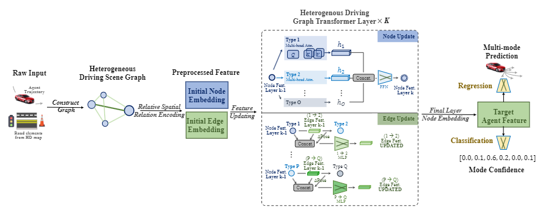

# HDGT: Modeling the Driving Scene with Heterogenity and Relativity

> **HDGT: Heterogeneous Driving Graph Transformer for Multi-Agent Trajectory Prediction via Scene Encoding** [IEEE TPAMI 2023] 
>
> - [Paper](http://arxiv.org/abs/2205.09753)

## Introduction

HDGT is an unified heterogeneous transformer-based graph neural network for driving scene encoding. It is a **SOTA method** on [INTERACTION](http://challenge.interaction-dataset.com/leader-board) and [Waymo](https://waymo.com/open/challenges/2021/motion-prediction/) Motion Prediction Chanllege.

By time of release in April 2022, the proposed method achieves new state-of-the-art on INTERACTION Prediction Challenge and Waymo Open Motion Challenge, in which we rank the **first** and **second** respectively in terms of the minADE/minFDE metric. 

## Getting Started

- [Installation](docs/INSTALL.md)
- [Prepare Dataset](docs/DATA_PREP.md)
- [Train & EVALUATION](docs/TRAIN_EVAL.md)


## License

All assets and code are under the [Apache 2.0 license](./LICENSE) unless specified otherwise.

## Bibtex
If this work is helpful for your research, please consider citing the following BibTeX entry.

```
@article{jia2023hdgt,
  title={HDGT: Heterogeneous Driving Graph Transformer for Multi-Agent Trajectory Prediction via Scene Encoding},
  author={Jia, Xiaosong and Wu, Penghao and Chen, Li and  Liu, Yu  and Li, Hongyang and Yan, Junchi},
  journal = {IEEE Transactions on Pattern Analysis and Machine Intelligence (TPAMI)},
  year = {2023},
}  
```

```
@inproceedings{jia2022temporal,
  title={Towards Capturing the Temporal Dynamics for Trajectory Prediction: a Coarse-to-Fine Approach},
  author={Jia, Xiaosong and Chen, Li and Wu, Penghao and Zeng, Jia and  Yan, Junchi and Li, Hongyang and Qiao, Yu},
  booktitle={CoRL},
  year={2022}
} 
```


