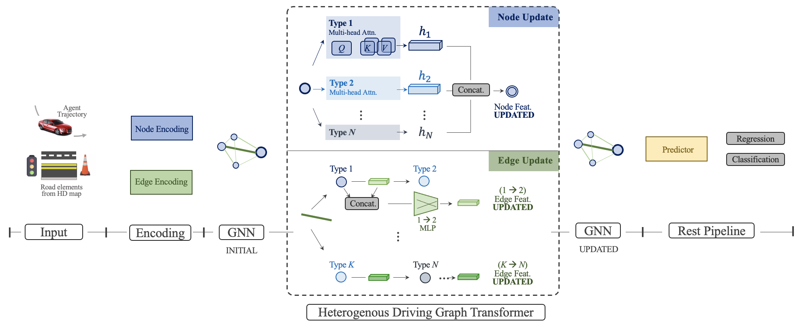

# HDGT
  

> [**HDGT: Heterogeneous Driving Graph Transformer for Multi-Agent Trajectory Prediction via Scene Encoding**](https://github.com/OpenPerceptionX/HDGT/blob/main/hdgt.pdf)

> [Xiaosong Jia](https://jiaxiaosong1002.github.io/), Penghao Wu, Li Chen, [Hongyang Li](https://lihongyang.info/), [Yu Liu](https://liuyu.us/), [Junchi Yan](https://thinklab.sjtu.edu.cn/)

## Introduction

HDGT is an unified heterogeneous transformer-based graph neural network for driving scene encoding. **SOTA method** on [INTERACTION](http://challenge.interaction-dataset.com/leader-board) and [Waymo](https://waymo.com/open/challenges/2021/motion-prediction/) Motion Prediction Chanllege. 

The code is in preparation.

## Acknowledgements

## License
  All content within this repository is under [Apache License 2.0](https://www.apache.org/licenses/LICENSE-2.0).
